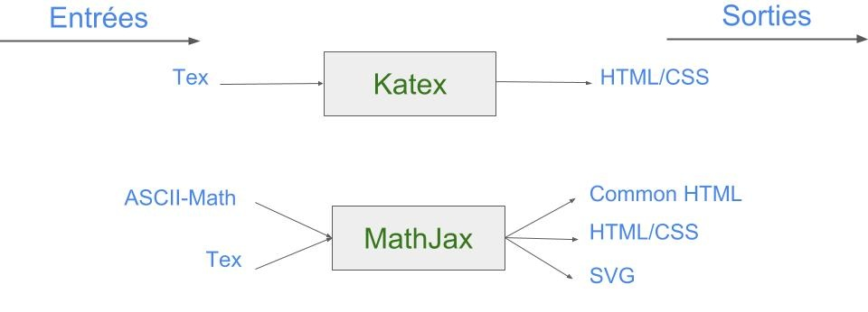
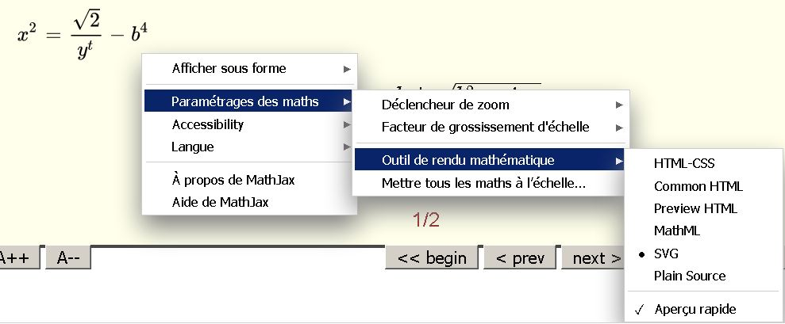

# Introduction des mathématiques dans EAST
Projet d'introduction des mathématiques dans EAST:EAsy Slides Toolkit. Ce document représente le résumé de l'étude que nous avons mené sur deux bibliothèques d'affichage de mathématiques et de la possibilité de leur intégration dans EAST. 

## Partie 1 : Les bibliothèques Katex et MathJax
Katex et MathJax sont développées en JavaScript. Il s'agit de deux bibliothèques OpenSources disponibles sur les liens suivants : [Katex](https://github.com/Khan/KaTeX)     -       [MathJax](https://www.mathjax.org/)

### Utilisation de Katex
Pour utiliser KaTex nous avons deux possibilité :
1. Télécharger la bibliothèque et la déployer sur un serveur Node.js.
2. Utiliser la version disponible à travers les serveurs CDN :
```html
<link rel="stylesheet" href="https://cdnjs.cloudflare.com/ajax/libs/KaTeX/0.9.0-alpha2/katex.min.css" integrity="sha384-exe4Ak6B0EoJI0ogGxjJ8rn+RN3ftPnEQrGwX59KTCl5ybGzvHGKjhPKk/KC3abb" crossorigin="anonymous">
<script src="https://cdnjs.cloudflare.com/ajax/libs/KaTeX/0.9.0-alpha2/katex.min.js" integrity="sha384-OMvkZ24ANLwviZR2lVq8ujbE/bUO8IR1FdBrKLQBI14Gq5Xp/lksIccGkmKL8m+h" crossorigin="anonymous"></script>
```
Ensuite pour utiliser KaTex il suffit d'appeler katex.render avec la formule mathématique en paramètre  : 
```js
katex.render("c = \\pm\\sqrt{a^2 + b^2}", element);
```
Sinon il existe la possibilité de faire le render automatique, autrement dit : l'affichage des formules mathématiques sera effectué d'une manière automatique et cela en faisant l'inclusion du script de Katex autorender:
```html
<script src="https://cdnjs.cloudflare.com/ajax/libs/KaTeX/0.9.0-alpha2/contrib/auto-render.min.js" integrity="sha384-cXpztMJlr2xFXyDSIfRWYSMVCXZ9HeGXvzyKTYrn03rsMAlOtIQVzjty5ULbaP8L" crossorigin="anonymous"></script>
```

### Utilisation de MathJax
Deux possibilités se présentent pour utilsier Mathjax:
1. Télécharger la bibliothèque et l'utiliser en local (pas besoin d'un serveur node.js).
2. Utiliser la version disponible à travers les serveurs CDN (Contrairement à KaTex, nous avons un seul mode de fontionnement qui est auto-render:
```html
<script src='https://cdnjs.cloudflare.com/ajax/libs/mathjax/2.7.2/MathJax.js?config=TeX-MML-AM_CHTML'></script>
```

### Taille de KaTex
La taille de la bibliothèque KaTex seule est `~3mo` mais si on prend en compte la taille des fichiers du serveur node.js `~57mo` donc le tout donnera une taille totale de : `~60mo`.

### Taille de MathJax 
La taille  de MathJax est évaluer à `~177mo`. Cette taille pourra être réduite (voir: Réduction MathJax).

### Les Entrées/Sorties de KaTex et de MathJax
Les entrées qui peuvent être utilisées, ainsi que les sorties possibles sont illustrées dans la figure suivante:


## Partie 2 : Intégration d'une bibliothèque dans EAST
Dans cette partie nous parlerons des différents choix que nous avons fais pour intégrer les mathématiques dans EAST.
### Choix de la bibliohtèqe
Nous avons décidé d'utiliser la bibliothèque MathJax pour les raisons suivants:  
1. La bibliothèque peut être utilisée directement sans avoir besoin de l'hébergée sur un serveur. Ce qui la rend le meilleure candidat pour être intégrée directement aux fichiers de configuration de EAST.   
2. MathJax offre plus de flexibilité en terme de fonctinnalités, entrées et sorties comparant à KaTex. On les résume:
    - MathJax offre plus d'entrées et de sorties que KaTex. 
    - MathJax offre un menu spécial qui s'affiche en cliquant sur une équation, et permet de modifier la sortie, d'effectuer des zoom uniquement sur les équtions aisni que d'autres choix supplémentaire: afficher l'aide, changer la langue du menu ...   
      
    - MathJax peut être réduit en terme de taille : On peut supprimer certains composant que nous jugerons non nécessaire au besoin. On peut aller plus loin en limitant les options d'affichage et les alternatives. Cette aspect est abordé en détails dans la partie suivate.  
## Réduction de la bibliothèque MathJax  
Nous avons essayer de réduire la taille de MathJax afin d'obtenir une taille minimale qui s'adapte au besoin. Dans cette partie nous allons illustré les différents possibilités qui se présentent afin de choisir la meilleur. 
### Phase 1: Elimination de tous ce qui est non nécessaire
On a commencer par éliminer tous ce qui est non nécessaire pour le fonctionnement de la biliothèque. Autrement dit cela n'affectera en aucun cas le fonctionnement ordinaire de MathJax.  
Taille initiale de MathJax:
```diff
177 mo
``` 
Eléments supprimés:
```diff
-MathJax/docs/*
-MathJax/tes/*
-MathJax/unpacked/*
-MathJax/.gitignore
-MathJax/.npmignore
-MathJax/.travis.yml
-MathJax/bower.json
-MathJax/composer.json
-MathJax/package.json
```
La taille des éléments éliminé est :
```diff
- 22 mo
```
Donc la taille après la première phase est :
```diff
+ 155 mo
```
### Phase 2 : Elimination des éléments qui fournissent des options supplémentaire 
MathJax offre plusieurs fichiers de configuration qui permettent de réduire le temps de chargement en combinanat plusieurs composants MathJax en un seul fichier dans le répertoire```MathJax/config```. Pour notre cas nous allons laisser un seul fichier de configuration qui nous permet d'utiliser toute les entrées/sorties que nous jugerons utile de les garder par la suite. Pour le moment nous nous contetant de garder le fichier qui permet d'utiliser toute les entrées et sorties de MathJax et nous supprimons le reste.
```diff
+MathJax/config/local/*
+MathJax/config/Accessible.js
+MathJax/config/Accessible-full.js
+MathJax/config/default.js
+MathJax/config/Safe.js
+MathJax/config/TeX-MML-AM_CHTML-full.js
+MathJax/config/TeX-MML-AM_HTMLorMML-full.js
+MathJax/config/TeX-MML-AM_SVG.js
+MathJax/config/TeX-MML-AM_SVG-full.js
```
La taille des éléments éliminé est :
```diff
- 5 mo
```
Donc la taille après la deuxième phase est :
```diff
+ 150 mo
```
 On peut aller plus loin dans cette phase pour éliminer ```~1mo``` supplémentaire après avoir choisir les entrées et sorties à garder.
 ### Phase 3 : Elimination des fonts
 La majorité des navigateur web récents support le format :  Web Open Fonts Format (.WOFF), ce qui fait que nous pouvons se contenter de ce format pour l'ensemble de font disponible dans MathJax. De ce fait nous allons garder le répertoir ```woff``` uniquement dans les dossiers des différents fonts et supprimer tous les autres répertoires.
 ```diff
 +MathJax/fonts/HTML-CSS/Asana-Math/woff/*
 +MathJax/fonts/HTML-CSS/Gyre-Pagella/woff/*
 +MathJax/fonts/HTML-CSS/Gyre-Termes/woff/*
 +MathJax/fonts/HTML-CSS/Latin-Modern/woff/*
 +MathJax/fonts/HTML-CSS/Neo-Euler/woff/*
 +MathJax/fonts/HTML-CSS/STIX-Web/woff/*
 +MathJax/fonts/HTML-CSS/TeX/woff/*
 ```
 La taille des éléments éliminé est :
```diff
- 126 mo
```
Donc la taille après la 3ème phase est :
```diff
+ 24 mo
```

On peut également aller plus loin dans cette phase. Vue qu'un seul font sera utilisé à la fin on peut supprimer les différents font et ne laisser q'un seul. Pour notre cas nous avons apprécié le Font ```Asana-Math``` donc nous allons supprimer les différents répertoires(fonts)  et ne laisser que les répertoires ```Asana-Math```(font choisi) et ```Tex```(nécessaire au fonctionnement de MathJax ) à partir des chemins suivant:
```diff
MathJax/fonts/HTML-CSS
MathJax/jax/output/HTML-CSS/fonts
MathJax/jax/output/SVG/fonts
```
 La taille des éléments éliminé est :
```diff
- 14 mo
```
Donc la taille finale de la bibliothèque est :
```diff
+ 10 mo
```
### Phase 4 : Limiter les choix 
On peut aller plus loin dans le processus de réduction pour obtenir des taille plus réduites en limitant aux utilisateur la possiblité de choisir plusieurs entrées/sorties. Dans le tableau qui suit les différents combinaions d'entrées/sorties ainsi que la taille de la bibliothèque obtenu (nous avons gardé que les combinaison qui permettent une réduction considérable de taille):  

Entrées | Sorties | Taille obtenue 
:--------------------------: | :--------------------------: | ------------------------: 
MML;ASCII-MATH;Tex | HTML/CSS | 7 mo 
MML;ASCII-MATH;Tex | SVG | 8 mo 
ASCII-MATH | HTML/CSS | 6 mo 
ASCII-MATH | SVG | 7 mo 

### Conclure l'étape de réduction
D'après ce que nous avons vu dans la partie précédente, nous avons décider de ne pas pénaliser l'utilisateur en le privant d'utiliser plusieurs entrées et sortie pour gagner ```~3mo``` . Pour cela nous avons décider de garder la bibliothèque avec toute les entrées et les sorties avec une taille de ```10mo```. De plus, vue que EAST sera par la suite comprésé, la taille de la bibliothèque après compression est ```4mo```.  
